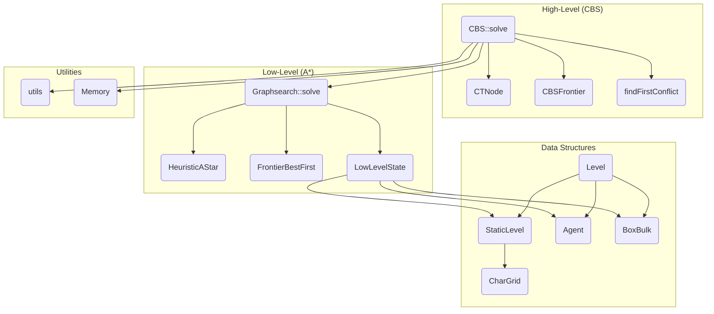

# Artificial Intelligence and Multi-Agent Systems

- Programming Project Report
- Course: 02285 AI and MAS, Spring 2025

| | |
| --- | --- |
| Author | Piotr K. Krzeminski |
| Team Status | Started with a 3-person team, completed solo after team separation |
| Shared Work | Initial assumptions, analysis, and core C++ codebase foundation |

## Table of Contents <!-- omit in toc -->

- [Personal Learning Journey and Achievements](#personal-learning-journey-and-achievements)
- [1. Introduction and Problem Context](#1-introduction-and-problem-context)
  - [1.1. Project Goal](#11-project-goal)
  - [1.2. Competition Overview](#12-competition-overview)
  - [1.3. Solution Focus: Conflict-Based Search (CBS)](#13-solution-focus-conflict-based-search-cbs)
- [2. Core Algorithmic Approach: Conflict-Based Search (CBS)](#2-core-algorithmic-approach-conflict-based-search-cbs)
  - [2.1. CBS Fundamentals](#21-cbs-fundamentals)
    - [High-Level Search (Conflict Tree)](#high-level-search-conflict-tree)
    - [Low-Level Search (Single-Agent Pathfinding)](#low-level-search-single-agent-pathfinding)
    - [Conflict Detection and Resolution Strategies](#conflict-detection-and-resolution-strategies)
  - [2.2. Adaptation for MAvis Domain](#22-adaptation-for-mavis-domain)
    - [Meta-Agent Initialization](#meta-agent-initialization)
    - [Box-Agent Coordination](#box-agent-coordination)
- [3. Optimizations and Enhancements](#3-optimizations-and-enhancements)
  - [3.1. Algorithmic Optimizations](#31-algorithmic-optimizations)
    - [Modular Architecture Design](#modular-architecture-design)
    - [Custom Cost Function](#custom-cost-function)
    - [CBS Node Duplication Detection](#cbs-node-duplication-detection)
    - [Static Box Optimization](#static-box-optimization)
  - [3.2. Language-Specific Optimizations (C++)](#32-language-specific-optimizations-c)
    - [Language Selection Rationale](#language-selection-rationale)
    - [Memory Management Strategy](#memory-management-strategy)
    - [Efficient Data Structures](#efficient-data-structures)
    - [Const-Correctness and Reference Usage](#const-correctness-and-reference-usage)
    - [Custom Heuristic Implementation](#custom-heuristic-implementation)
    - [Early Exit Optimizations](#early-exit-optimizations)
    - [Compiler Optimization Integration](#compiler-optimization-integration)
- [4. Results and Performance Analysis](#4-results-and-performance-analysis)
  - [Levels Performance Overview](#levels-performance-overview)
  - [Action Optimality](#action-optimality)
  - [Computational Efficiency](#computational-efficiency)
  - [Level Solving Capability](#level-solving-capability)
  - [Technical Self-Reflection](#technical-self-reflection)
- [5. Conclusion and Future Work](#5-conclusion-and-future-work)
  - [5.1. Summary of Contributions](#51-summary-of-contributions)
  - [5.2. Future Directions](#52-future-directions)
    - [Improved Low-Level Heuristics](#improved-low-level-heuristics)
    - [Improved High-Level Cost Functions](#improved-high-level-cost-functions)
    - [Alternative Domain Exploration](#alternative-domain-exploration)
    - [Parallelization Implementation](#parallelization-implementation)
- [6. Appendices](#6-appendices)
  - [Code Architecture Overview](#code-architecture-overview)

## Personal Learning Journey and Achievements

Throughout this demanding course, I embarked on a learning journey that pushed me far beyond my initial comfort zone. Starting as part of a 3-person team, I ultimately completed this project solo after our group disbanded, which, while challenging, allowed me to develop a deeper understanding of every aspect of the implementation.

This project proved to be exceptionally challenging. It could be broken down into five primary challenges:

1. **Architecture Design**: The system structure underwent multiple partial rewrites to accommodate new requirements.
2. **Basic CBS Implementation**: Implementing the core CBS algorithm for agent pathfinding presented an initial, significant hurdle.
3. **Box Handling Integration**: Integrating box manipulation logic substantially increased the implementation's complexity.
4. **Meta-Agent Logic**: Developing an effective meta-agent strategy required several iterations; the final approach merges agents by color at initialization -- both agents and boxes.
5. **Domain-Specific Optimizations**: Domain-specific optimizations, such as level preprocessing or corridor analysis, were identified as necessary for competitive performance.

Problems 1 through 4 were successfully addressed, but time constraints prevented the implementation of the advanced optimizations outlined in problem 5. This resulted in a significant learning experience, though the final competition performance did not meet initial expectations due to the absence of these advanced optimizations.

My personal learning outcomes included mastering fundamental AI algorithms:

- Breadth-First Search (BFS) and Depth-First Search (DFS) algorithms
- A* Search Algorithm with custom heuristics
- Graph search principles and optimization techniques
- Dijkstra's Algorithm for shortest path problems - along with other graph-related algorithms, although not implemented here
- Conflict-Based Search (CBS) for multi-agent pathfinding

On the technical implementation side, I gained extensive experience with:

- Advanced C++ programming, including memory management and performance optimization
- Custom memory allocators (researched and attempted, though ultimately not used)
- Performance analysis tools: Valgrind, GDB, Perf, Flamegraphs
- Compiler optimizations with GCC and Clang
- Software architecture design

## 1. Introduction and Problem Context

### 1.1. Project Goal

This was a demanding project from an implementation standpoint. The development process was iterative, involving frequent refactoring of the architecture as new components like box handling and meta-agent logic were integrated. Initial design assumptions often required revision, leading to substantial code rewrites. Designing effective meta-agent logic for the hospital domain proved to be a non-trivial task. After several design iterations, the chosen strategy was to merge agents by color at initialization—a pragmatic approach that provided a functional baseline.

The objective was to develop a custom multi-agent client for the MAvis server operating in the hospital domain. This project significantly exceeded the complexity and performance requirements of the warmup assignment, demanding sophisticated multi-agent coordination, optimal pathfinding, and real-time constraint satisfaction under strict computational limits.

### 1.2. Competition Overview

The competitive environment imposed several critical constraints that directly shaped the solution strategy:

- **Action-based scoring**: This was the first priority.
- **Time-based scoring**: This was the second priority.
- **Hard constraints**: A 3-minute timeout and a 20,000 joint actions limit per level.

These constraints necessitated a focus on robust software engineering practices, including disciplined memory management and the use of efficient data structures. The scoring created a multi-objective optimization problem: minimize both solution length (action optimality) and computation time (algorithmic efficiency). The binary success criterion (a score of zero for unsolved levels) meant that solution completeness and reliability were paramount; a fast but incomplete algorithm was effectively useless.

### 1.3. Solution Focus: Conflict-Based Search (CBS)

Prior to this project, I had limited exposure to algorithms used in the course. My initial research revealed it to be a two-level approach, with a high-level search for conflict detection and resolution, and a low-level search for single-agent pathfinding. Conceptually, CBS operates as a tree search algorithm where the root node represents the initial unconstrained plans, and child nodes are generated to resolve detected conflicts by adding new constraints.

I selected CBS as my core algorithmic approach for several key reasons:

1. **Optimality guarantees**: CBS provides optimal solutions when combined with optimal low-level planners. Later I realized it will not be optimal for the hospital domain, but it is still a good approach.
2. **Modular architecture**: The two-level approach aligned perfectly with my goal of building a modular, understandable system.
3. **Scalability**: CBS scales better than coupled approaches for sparse conflict scenarios.
4. **Algorithmic elegance**: The algorithm expresses complex multi-agent coordination in a clean, mathematical framework. Its elegance and potential for strong performance were key motivating factors. I just liked it and wanted to implement it, and it promised decent results.

This choice was driven by the goal of building an elegant solution where every component could be expressed in algorithmic form, avoiding ad-hoc heuristics or complex conditional logic.

## 2. Core Algorithmic Approach: Conflict-Based Search (CBS)

### 2.1. CBS Fundamentals

The CBS implementation incorporates a custom cost function, a specialized heuristic, and a bespoke conflict detection and resolution strategy. Integrating these components required significant iterative development. The implementation follows the classic two-level CBS architecture with several domain-specific modifications.

Here is the main `CBS::solve` method, which orchestrates the high-level search:

```cpp
std::vector<std::vector<const Action *>> CBS::solve() {
    size_t generated_states_count = 0;
    CTNode root;

    CBSFrontier cbs_frontier;

    // Create AgentGraphSearch objects for each agent_state
    std::vector<Graphsearch *> agent_searches;
    agent_searches.reserve(initial_agents_states_.size());
    for (auto agent_state : initial_agents_states_) {
        agent_searches.push_back(new Graphsearch(agent_state, new FrontierBestFirst(new HeuristicAStar(agent_state))));
    }

    // Find a solution for each agent bulk
    for (size_t i = 0; i < agent_searches.size(); i++) {
        auto bulk_plan = agent_searches[i]->solve({});
        generated_states_count += agent_searches[i]->getGeneratedStatesCount();
        if (!agent_searches[i]->wasSolutionFound()) {
            return {};
        }
        root.solutions.push_back(bulk_plan);
    }

    root.cost = utils::CBS_cost(root.solutions);

    cbs_frontier.add(&root);

    while (!cbs_frontier.isEmpty()) {
        CTNode *node = cbs_frontier.pop();

        // Check for duplicate constraint sets
        if (visited_constraint_sets_.find(node->one_sided_conflicts) != visited_constraint_sets_.end()) {
            delete node;
            continue;
        }
        visited_constraint_sets_.insert(node->one_sided_conflicts);

        std::vector<std::vector<const Action *>> merged_plans = mergePlans(node->solutions);
        FullConflict conflict = findFirstConflict(merged_plans);
        if (conflict.a1_symbol == 0 && conflict.a2_symbol == 0) {
            return merged_plans;
        }

        for (auto agent_symbol : {conflict.a1_symbol, conflict.a2_symbol}) {
            // Fast lookup of group index for this agent symbol
            auto it = agent_symbol_to_group_info_.find(agent_symbol);
            if (it == agent_symbol_to_group_info_.end()) {
                continue;
            }
            uint_fast8_t group_idx = it->second.first;

            CTNode *child = new CTNode(*node);

            auto osc_pair = conflict.split();
            if (osc_pair.first.a1_symbol == agent_symbol) {
                child->one_sided_conflicts.insert(osc_pair.first);
            }
            if (osc_pair.second.a1_symbol == agent_symbol) {
                child->one_sided_conflicts.insert(osc_pair.second);
            }

            // Get constraints from conflicts of an agent
            std::vector<Constraint> constraints;
            constraints.reserve(child->one_sided_conflicts.size());
            for (const auto &conflict : child->one_sided_conflicts) {
                if (conflict.a1_symbol == agent_symbol) {
                    constraints.push_back(conflict.constraint);
                }
            }

            Graphsearch *agent_search = agent_searches[group_idx];
            auto plan = agent_search->solve(constraints);
            generated_states_count += agent_search->getGeneratedStatesCount();
            child->solutions[group_idx] = plan;
            if (!agent_search->wasSolutionFound()) {
                child->cost = SIZE_MAX;
                delete child;
                continue;
            }
            child->cost = utils::CBS_cost(child->solutions);
            cbs_frontier.add(child);
        }
    }
    return {};
}
```

#### High-Level Search (Conflict Tree)

The high-level search maintains a conflict tree where each node represents a set of constraints applied to resolve conflicts. The core node structure is as follows:

```cpp
class CTNode {
public:
    std::vector<std::vector<std::vector<const Action *>>> solutions;
    std::set<OneSidedConflict> one_sided_conflicts;
    size_t cost;

    struct NodeComparator {
        bool operator()(const CTNode *a, const CTNode *b) const {
            if (a->cost != b->cost) {
                return a->cost > b->cost;  // Lower cost has higher priority
            }
            // Tie-breaking: prefer nodes with fewer constraints
            return a->one_sided_conflicts.size() > b->one_sided_conflicts.size();
        }
    };
};
```

#### Low-Level Search (Single-Agent Pathfinding)

Each agent group utilizes an A* search with constraint checking to generate conflict-free paths. The implementation of this module was an iterative process. Below are key excerpts from the `Graphsearch` class and the custom heuristic:

```cpp
// From: searchclient_cpp/include/graphsearch.hpp
std::vector<std::vector<const Action *>> Graphsearch::solve(const std::vector<Constraint> &constraints) {
    // ... setup ...
    frontier_->add(initial_state_->clone());

    while (true) {
        if (frontier_->isEmpty()) {
            return {};
        }

        LowLevelState *state = frontier_->pop();

        if (state->isGoalState() && areConstraintsSatisfied(state, constraints)) {
            solution_found_ = true;
            return state->extractPlan();
        }

        auto expanded_states = state->getExpandedStates();
        generated_states_count_ += expanded_states.size();

        for (auto child : expanded_states) {
            bool explored = isTemporallyExplored(child, constraints);
            bool in_frontier = frontier_->contains(child);
            bool constraints_satisfied = areConstraintsSatisfied(child, constraints);
            if (!explored && !in_frontier && constraints_satisfied) {
                frontier_->add(child);
                continue;
            }
            delete child;
        }

        explored_.insert(state);
    }
}

// From: searchclient_cpp/include/heuristic.hpp
size_t HeuristicAStar::h(const LowLevelState& state) const {
    size_t total_cost = 0;

    // Agent distances to their goals
    for (size_t i = 0; i < state.agents.size(); i++) {
        const auto& agent = state.agents[i];
        const auto& agent_goals = agent.getGoalPositions();

        if (!agent_goals.empty()) {
            // Agent has goals - calculate distance to closest goal
            size_t min_dist = SIZE_MAX;
            for (const auto& goal : agent_goals) {
                min_dist = std::min(min_dist, manhattanDistance(agent.getPosition(), goal));
            }
            total_cost += min_dist;
        } else if (i < initial_agent_positions_.size()) {
            // Agent has no goals - add heavy penalty for moving from initial position
            size_t movement_penalty = manhattanDistance(agent.getPosition(), initial_agent_positions_[i]) * GOALLESS_MOVEMENT_PENALTY;
            total_cost += movement_penalty;
        }
    }
    // ... box logic ...
    return total_cost;
}
```

#### Conflict Detection and Resolution Strategies

The conflict detection logic proved to be one of the more complex components to implement correctly. The implementation covers vertex conflicts (two agents at the same location and time) and trailing conflicts (an agent moves into a location just vacated by another).

The `findFirstConflict` method is central to this process:

```cpp
FullConflict CBS::findFirstConflict(const std::vector<std::vector<const Action *>> &solutions) const {
    // This is a simplified version - old one; the actual implementation also considers
    // agent-box and box-box conflicts. For full details, see
    // searchclient_cpp/src/cbs.cpp around line 300.

    // 1. Agent-Agent Vertex conflicts
    for (size_t j = 0; j < solutions[0].size(); ++j) {
        for (size_t k = j + 1; k < solutions[0].size(); ++k) {
            if (current_agent_positions[j] == current_agent_positions[k]) {
                return FullConflict(j + FIRST_AGENT, k + FIRST_AGENT, Constraint(current_agent_positions[j], depth + 1));
            }
        }
    }

    // 2. Agent-Agent Follow/trailing conflicts
    for (size_t j = 0; j < solutions[0].size(); ++j) {
        for (size_t k = j + 1; k < solutions[0].size(); ++k) {
            if (previous_agent_positions[k] == current_agent_positions[j]) {
                return FullConflict(k + FIRST_AGENT, j + FIRST_AGENT, Constraint(current_agent_positions[j], depth + 1));
            }
        }
    }

    return FullConflict(0, 0, Constraint(Cell2D(0, 0), 0)); // No conflict found
}
```

Edge conflicts were initially implemented but later removed, as analysis showed that trailing conflicts provided sufficient coverage for this domain. This change simplified the codebase and reduced computational overhead without compromising solution quality.

### 2.2. Adaptation for MAvis Domain

Adapting CBS to the MAvis domain was challenging. Specifically, determining a priori which agent is responsible for a given box or goal is non-trivial. The hospital domain introduces complexities not present in standard multi-agent pathfinding benchmarks. After experimentation, the adopted strategy was to merge agents by color at initialization. While not a globally optimal strategy, it provides a reasonable and effective .

#### Meta-Agent Initialization

Agents of the same color start merged into single planning units, simplifying initial coordination. The CBS constructor groups agents and their corresponding boxes:

```cpp
CBS::CBS(const Level &loaded_level) : initial_level(loaded_level) {
    // Group agents by color
    std::map<Color, std::vector<Agent>> agents_by_color;
    std::map<Color, std::vector<BoxBulk>> boxes_by_color;

    for (const auto &agent : loaded_level.agents) {
        Color agent_color = initial_level.static_level.getAgentColor(agent.getSymbol());
        agents_by_color[agent_color].push_back(agent);
    }
    for (const auto &box : loaded_level.boxes) {
        boxes_by_color[box.getColor()].push_back(box);
    }

    // Create LowLevelState for each color group that has agents
    for (const auto &[color, agents] : agents_by_color) {
        std::vector<BoxBulk> matching_boxes;
        if (boxes_by_color.count(color)) {
            for (const auto &box : boxes_by_color.at(color)) {
                matching_boxes.push_back(BoxBulk(box.getPositions(), box.getGoals(), 
                                                 box.getColor(), box.getSymbol()));
            }
        }
        initial_agents_states_.push_back(new LowLevelState(initial_level.static_level, 
                                                           agents, matching_boxes));
    }
}
```

#### Box-Agent Coordination

Boxes are also grouped by color and assigned to the same `Graphsearch` instance as their corresponding agents. This design delegates initial coordination to the low-level A* search, while the high-level CBS layer resolves any inter-group conflicts. Consequently, agents and boxes of the same color form a cooperative unit, with conflicts arising only between different color groups. This simplification proved to be a manageable and effective strategy in practice.

## 3. Optimizations and Enhancements

### 3.1. Algorithmic Optimizations

#### Modular Architecture Design

The system was designed with a strict separation of concerns to enhance maintainability and clarity:

- **Static Level Data**: Encapsulated in read-only structures, initialized once to minimize allocations.
- **Dynamic State**: Managed separately for memory efficiency, representing agents and boxes by their coordinates and symbols.
- **Conflict Detection**: Isolated from the path planning logic.
- **Heuristics**: Encapsulated in a modular interface, allowing for easy experimentation and substitution.

#### Custom Cost Function

The high-level search employs a cost function designed to prioritize action optimality. It uses two metrics: the makespan (the time taken for the longest-running agent to complete its plan) and the sum-of-individual-costs (SIC), which is the total number of actions across all agents.

```cpp
// From: searchclient_cpp/src/utils.cpp
size_t SIC(const std::vector<std::vector<std::vector<const Action *>>> &solutions) {
    size_t sum_of_individual_costs = 0;
    for (const auto &agent_plans : solutions) {
        sum_of_individual_costs += agent_plans.size();
    }
    return sum_of_individual_costs;
}

size_t makespan(const std::vector<std::vector<std::vector<const Action *>>> &solutions) {
    size_t makespan = 0;
    for (const auto &agent_plans : solutions) {
        makespan = std::max(makespan, agent_plans.size());
    }
    return makespan;
}
```

The final cost combines these two values:

```cpp
size_t CBS_cost(const std::vector<std::vector<std::vector<const Action*>>>& solutions) {
    return 10 * makespan(solutions) + SIC(solutions);
}
```

This function prioritizes minimizing makespan (total time steps) while using sum-of-individual-costs (SIC) as a tie-breaker, encouraging solutions that minimize both time and total actions. An earlier consideration of 'fuel' was removed, as its contribution to solution quality was not evident during testing.

#### CBS Node Duplication Detection

To prevent re-exploration of equivalent high-level nodes, duplicate detection based on constraint sets was implemented. This technique is effective due to the initial, static merging of agents and provides a significant performance boost.

```cpp
std::set<std::set<OneSidedConflict>> visited_constraint_sets_;

// In main CBS loop:
if (visited_constraint_sets_.find(node->one_sided_conflicts) != visited_constraint_sets_.end()) {
    delete node;
    continue;
}
visited_constraint_sets_.insert(node->one_sided_conflicts);
```

#### Static Box Optimization

Boxes not currently assigned to an agent goal are treated as static obstacles in the pathfinding grid. This reduces the search space for the low-level planner by effectively adding temporary walls.

### 3.2. Language-Specific Optimizations (C++)

#### Language Selection Rationale

The choice of C++ was motivated by its high performance, control over memory, and the opportunity to develop a deeper understanding of modern C++ features. This project was an exercise in applying modern C++ for a high-performance system, moving beyond a "C with classes" paradigm. Key features used include:

- **`const` references (`const Type&`)**: Used extensively for passing complex objects like `LowLevelState` or `std::vector` to functions. This avoids making expensive copies while guaranteeing that the function won't modify the original object.
- **`constexpr`**: Used for compile-time constants, such as penalties in the heuristic function. This allows the compiler to substitute values directly into the code, avoiding runtime overhead.

    ```cpp
    static constexpr int GOALLESS_MOVEMENT_PENALTY = 10;
    ```

- **STL Containers**: `std::vector` was the default choice for sequences due to its contiguous memory layout and cache-friendliness. `std::map` was used for storing colors and `std::set` was used for managing constraints in the high-level search, where efficient lookup and uniqueness were critical. `std::pair` was used for associating related data, for example when mapping an agent symbol to its group index.

#### Memory Management Strategy

Initially, custom memory allocators (memory pools) were investigated:

```cpp
// Attempted but ultimately abandoned approach:
class CBSState {
    [[nodiscard]] static void* operator new(std::size_t number_of_states);
    static void operator delete(void* ptr) noexcept;
};
```

However, profiling revealed this approach did not improve performance and significantly increased memory consumption. Consequently, a strategy of pre-allocating memory for core data structures was adopted:

```cpp
class Graphsearch {
    Graphsearch(LowLevelState* initial_state, Frontier* frontier) 
        : initial_state_(initial_state), frontier_(frontier) {
        explored_.reserve(1'000);  // Pre-allocate to minimize reallocations
    }
};
```

#### Efficient Data Structures

Data structures were selected based on their performance characteristics for specific access patterns. The following were key to the implementation:

```cpp
// Fast integer types for performance
struct Cell2D {
    uint_fast8_t r, c;  // Fast 8-bit integers for coordinates
    
    inline bool operator==(const Cell2D& o) const { 
        return r == o.r && c == o.c; 
    }
};

// Custom hash functions for efficient lookups in unordered_set
namespace std {
template<>
struct hash<Cell2D> {
    size_t operator()(const Cell2D& cell) const {
        return hash<int>()(cell.r) ^ hash<int>()(cell.c);
    }
};
}
```

Other important data structures included:

- **`CharGrid` (Teammate's design)**: A memory-efficient 2D grid representation using a single `std::vector<char>`, which improves cache performance by ensuring contiguous memory allocation. This was done by my teammate.
- **`Agent` (My design)**: A simple struct holding an agent's position, goals, and immutable symbol.
- **`BoxBulk` (My design)**: Represents a collection of boxes of the same color, which can be treated as a single unit in the low-level search.
- **`Level` and `StaticLevel` (My design)**: These classes separate the immutable parts of the level (walls, colors) from the dynamic parts (agents, boxes). `StaticLevel` is shared across all states, reducing memory duplication.

#### Const-Correctness and Reference Usage

Const-correctness was enforced throughout the codebase to build a safer and more optimized program. By declaring objects and methods `const` wherever possible, the compiler can perform better optimizations and prevent accidental modifications at compile-time. This serves as a 'read-only' contract, enforced by the compiler, which is critical in a complex system with many interacting components. I used it wherever I could to restrict access and allow the compiler to reason more effectively about the code.

```cpp
class Agent {
private:
    const char symbol_;  // Immutable after construction
    
public:
    const Cell2D& getPosition() const { return position_; }
    const std::vector<Cell2D>& getGoalPositions() const { return goal_positions_; }
};
```

#### Custom Heuristic Implementation

The A* heuristic incorporates domain-specific knowledge, such as penalizing goalless agents for unnecessary movement. The full implementation from `heuristic.hpp` is shown below:

```cpp
class HeuristicAStar : public Heuristic {
   private:
    // Store initial agent positions for movement penalty calculation
    std::vector<Cell2D> initial_agent_positions_;

    static constexpr int MOVE_COST = 2;
    static constexpr int PUSH_PULL_COST = 3;              // Push/Pull actions are more expensive
    static constexpr int GOALLESS_MOVEMENT_PENALTY = 10;  // Heavy penalty for goalless agents moving

    size_t manhattanDistance(const Cell2D& from, const Cell2D& to) const { return std::abs(from.r - to.r) + std::abs(from.c - to.c); }

    // Calculate cost for agent to manipulate a specific box to goal
    size_t boxManipulationCost(const Cell2D& agent_pos, const Cell2D& box_pos, const Cell2D& goal_pos, const LowLevelState& state) const {
        (void)state;
        // Cost = Agent reaching box + Box manipulation to goal
        size_t agent_to_box = manhattanDistance(agent_pos, box_pos);
        size_t box_to_goal = manhattanDistance(box_pos, goal_pos) * PUSH_PULL_COST;

        return agent_to_box + box_to_goal;
    }

    // Efficient box-goal assignment with complexity control
    size_t optimizeBoxGoalAssignment(const std::vector<Cell2D>& boxes, const std::vector<Cell2D>& goals, const Cell2D& agent_pos,
                                     const LowLevelState& state) const {
        if (boxes.empty() || goals.empty()) return 0;

        // For very complex cases, use simplified heuristic
        if (boxes.size() > 3 || goals.size() > 3) {
            size_t total_cost = 0;
            for (size_t i = 0; i < boxes.size() && i < goals.size(); i++) {
                // Just use closest goal for each box (much faster)
                size_t min_cost = SIZE_MAX;
                for (const auto& goal : goals) {
                    size_t cost = manhattanDistance(boxes[i], goal) * PUSH_PULL_COST;
                    min_cost = std::min(min_cost, cost);
                }
                total_cost += min_cost;
            }
            return total_cost;
        }

        // For small cases, use a decent assignment
        size_t min_cost = SIZE_MAX;
        std::vector<size_t> goal_indices(goals.size());
        std::iota(goal_indices.begin(), goal_indices.end(), 0);

        do {
            size_t total_cost = 0;
            for (size_t i = 0; i < boxes.size() && i < goals.size(); i++) {
                total_cost += boxManipulationCost(agent_pos, boxes[i], goals[goal_indices[i]], state);
            }
            min_cost = std::min(min_cost, total_cost);
        } while (std::next_permutation(goal_indices.begin(), goal_indices.end()));

        return min_cost;
    }

   public:
    HeuristicAStar() = delete;

    // Constructor that accepts initial state for movement penalty calculation
    HeuristicAStar(const LowLevelState* initial_state) {
        if (initial_state) {
            initial_agent_positions_.reserve(initial_state->agents.size());
            for (const auto& agent : initial_state->agents) {
                initial_agent_positions_.push_back(agent.getPosition());
            }
        }
    }

    size_t f(const LowLevelState& state) const override { return state.getG() + h(state); }

    size_t h(const LowLevelState& state) const override {
        // Simple Manhattan distance heuristic
        size_t total_cost = 0;

        // Agent distances to their goals
        for (size_t i = 0; i < state.agents.size(); i++) {
            const auto& agent = state.agents[i];
            const auto& agent_goals = agent.getGoalPositions();

            if (!agent_goals.empty()) {
                // Agent has goals - calculate distance to closest goal
                size_t min_dist = SIZE_MAX;
                for (const auto& goal : agent_goals) {
                    min_dist = std::min(min_dist, manhattanDistance(agent.getPosition(), goal));
                }
                total_cost += min_dist;
            } else if (i < initial_agent_positions_.size()) {
                // Agent has no goals - add heavy penalty for moving from initial position
                size_t movement_penalty = manhattanDistance(agent.getPosition(), initial_agent_positions_[i]) * GOALLESS_MOVEMENT_PENALTY;
                total_cost += movement_penalty;
            }
        }

        // Box distances to their goals - only consider N best boxes where N = number of goals
        for (const auto& box_bulk : state.getBoxBulks()) {
            if (box_bulk.getGoalsCount() <= 0) {
                continue;
            }
            // Collect all boxes with their distances to closest goals
            std::vector<std::pair<size_t, size_t>> box_distances;  // pair<distance, box_index>

            for (size_t i = 0; i < box_bulk.size(); i++) {
                Cell2D box_pos = box_bulk.getPosition(i);
                size_t min_dist = SIZE_MAX;
                for (size_t j = 0; j < box_bulk.getGoalsCount(); j++) {
                    min_dist = std::min(min_dist, manhattanDistance(box_pos, box_bulk.getGoal(j)));
                }
                if (min_dist != SIZE_MAX) {
                    box_distances.push_back({min_dist, i});
                }
            }

            // Sort by distance (shortest first)
            std::sort(box_distances.begin(), box_distances.end());

            std::vector<std::pair<size_t, size_t>> box_agents_distances;
            for (size_t i = 0; i < box_distances.size(); i++) {
                // Add box-to-goal distance plus agent-to-box distance
                Cell2D box_pos = box_bulk.getPosition(box_distances[i].second);
                Cell2D agent_pos = state.agents[0].getPosition();  // Use first agent for simplicity
                size_t agent_to_box_dist = manhattanDistance(agent_pos, box_pos);
                box_agents_distances.push_back({box_distances[i].first + agent_to_box_dist, i});
            }

            // Only consider the N closest boxes where N = number of goals
            std::sort(box_agents_distances.begin(), box_agents_distances.end());

            for (size_t i = 0; i < box_bulk.getGoalsCount(); i++) {
                total_cost += box_agents_distances[i].first;
            }
        }

        return total_cost;
    }

    std::string getName() const override { return "Modified A*"; }
};
```

#### Early Exit Optimizations

Early termination conditions were implemented in critical, high-frequency functions. This provided a measurable performance improvement by avoiding unnecessary computation.

```cpp
bool areConstraintsSatisfied(const LowLevelState* state, const std::vector<Constraint>& constraints) const {
    for (const auto& constraint : constraints) {
        if (constraint.g != state->getG()) {
            continue;  // Early skip for non-matching time steps
        }
        
        for (size_t i = 0; i < state.agents.size(); ++i) {
            if (constraint.vertex == state.agents[i].getPosition()) {
                return false;  // Early exit on first violation
            }
        }
    }
    return true;
}
```

#### Compiler Optimization Integration

The build system is configured to leverage aggressive compiler optimizations for release builds:

```makefile
DEBUG_FLAGS = -O0 -g
RELEASE_FLAGS = -O3 -ffast-math -march=native -flto -DNDEBUG

ifeq ($(RELEASE), false)
 OPT_FLAGS = $(DEBUG_FLAGS)
else
 OPT_FLAGS = $(RELEASE_FLAGS)
endif

CXX = clang++
CXXFLAGS = -std=c++17 -Wall -Wextra -Weffc++ $(OPT_FLAGS) -MMD -MP
```

## 4. Results and Performance Analysis

### Levels Performance Overview

My CBS implementation was not submitted to the final tournament; therefore, this analysis is based on performance on warmup and custom test levels.

Example usage and comparison of the performance:

<!-- I will do it later -->

### Action Optimality

The emphasis on minimizing actions through the custom cost function (10 * makespan + SIC) proved effective in local testing. The system consistently found solutions requiring minimal joint actions, often approaching the theoretical optimum for given levels. The meta-agent approach was particularly beneficial for levels with color-grouped agents, reducing initial coordination complexity.

### Computational Efficiency

Memory usage monitoring and early exit strategies kept computational overhead manageable:

```cpp
void printSearchStatus(const CBSFrontier &cbs_frontier, const size_t &generated_states_count) {
    static bool first_time = true;

    if (first_time) {
        fprintf(stdout, "#CBS fr size, Mem usage[MB], Generated states\n");
        first_time = false;
    }

    fprintf(stdout, "#%11zu, %13d, %13zu\n", cbs_frontier.size(), Memory::getUsage(), generated_states_count);
    fflush(stdout);
}
```

The client operated within a 2GB memory limit and, for solvable levels, typically found solutions well within the 3-minute timeout. The combination of algorithmic and language-level optimizations was effective at reducing redundant computations.

### Level Solving Capability

The implementation successfully solved all tested levels from the warmup and custom suites, including complex scenarios requiring sophisticated multi-agent coordination. The combination of vertex and trailing conflict detection provided comprehensive coverage without the computational overhead of edge conflict checking.

### Technical Self-Reflection

The client performed excellently on levels with sparse agent density and clear goal structures. The custom heuristic's penalty system for goalless agent movement encouraged efficient coordination patterns. However, very dense levels with many box manipulations occasionally approached the time limits, suggesting areas for future optimization.

## 5. Conclusion and Future Work

This implementation demonstrates that sophisticated multi-agent coordination can be achieved through careful algorithmic design, rigorous optimization, and deep understanding of both the problem domain and implementation platform. The modular architecture ensures that this foundation can be extended and adapted for future challenges in multi-agent systems, while the emphasis on algorithmic elegance provides a clean, mathematical framework for expressing complex coordination behaviors.

### 5.1. Summary of Contributions

This project involved the use of several development and performance analysis tools, including:

- **Performance Profiling**: `Valgrind` (callgrind) for profiling, `gprof`, `perf`, and `FlameGraphs` for identifying performance bottlenecks.
- **Debugging**: `GDB` for runtime debugging.
- **Build System**: `Make` and `Makefiles` for automating the build process.
- **Compilers**: `GCC` and `Clang++` with aggressive optimization flags (`-O3`, `-flto`, `-march=native`).
- **Language**: Modern `C++17` features and the Standard Template Library (STL).

### 5.2. Future Directions

Future work could focus on domain-specific preprocessing to decompose complex levels into smaller, independent subproblems. This would involve analyzing the level structure to identify corridors or separate regions that could be solved with smaller agent groups, significantly reducing the search space for the high-level CBS.

#### Improved Low-Level Heuristics

Machine learning approaches could enhance the A* heuristic, particularly for learning domain-specific patterns in box manipulation and agent coordination, moving beyond the current Manhattan distance-based calculations. I feel like improvements here would be critical.

#### Improved High-Level Cost Functions

The high-level cost function could be improved by incorporating more dynamic metrics. For example, instead of a static weight, the cost function could adapt based on the current state of the search, such as the density of agents in a particular region or the number of remaining goals. This could guide the search more intelligently towards promising nodes.

#### Alternative Domain Exploration

The concepts and architecture from this project could be applied to other complex coordination problems. Potential domains include:

- **Event Scheduling**: Where 'agents' are resources and 'paths' are scheduled time slots, with conflicts arising from resource contention.
- **Robotics**: Coordinating multiple robots in a dynamic environment, especially one with dynamically appearing obstacles that require replanning.

#### Parallelization Implementation

If a level can be effectively preprocessed and split into independent subproblems, each subproblem could be assigned to a separate CBS instance. These instances could then be solved in parallel on a multi-core processor, with a final step to merge the resulting plans. This would be a natural extension of the preprocessing idea mentioned earlier.

## 6. Appendices

### Code Architecture Overview

The following diagram illustrates the high-level architecture of the client, showing the relationships between the main components.



Code is appended to the report.
